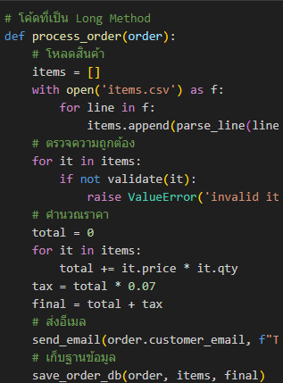
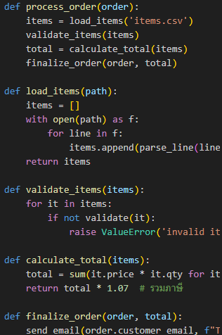

## Code smell กลิ่นเเปลกๆ
ถ้าฟังผ่านๆ อาจจะคิดว่า code มันมีกลิ่นตุๆ code มันมีกลิ่นได้ด้วยเหรอเเต่จริงๆเเล้วมันคือคำเปรียบเทียบว่าในการเขียน code นั้นในบางส่วนที่เราเขียนมันมี error ที่อาจจะส่งผลในระยะยาว (มันไม่ใช่ bug) 

## Long Method  
function หรือเมทอดที่ยาวเพราะทำหลายอย่าง อ่านยากและทดสอบยาก ควรแยกงานเป็น function ย่อย (เช่น โหลด, ตรวจ, คำนวณ, สรุป) เพื่อความชัดเจน แต่ถ้า function ยังสั้น เข้าใจง่าย และไม่มีการซ้ำซ้อนจริง ๆ ก็ไม่จำเป็นต้องแก้

ตัวอย่าง  
def process_order(order):  

โหลดสินค้า  
ตรวจความถูกต้อง  
คำนวณราคา  
ส่งอีเมล  
เก็บฐานข้อมูล

  
## Refactoring  
def process_order(order)  
def load_items(path):  
def validate_items(items):  
def calculate_total(items):  
def finalize_order(order, total):

## เมื่อไม่จำเป็นต้อง refactor  
ฟังก์ชันยังอ่านง่ายและชัดเจนแม้จะยาวหน่อย, ไม่มีการซ้ำที่ต้องดึงออกมา, มี test ครอบคลุม, เป็น script ชั่วคราว, หรือการแยกย่อยจะเพิ่มความซับซ้อน/ทำให้จัดการ state/transaction ยาก กรณีพวกนี้อาจไม่ต้อง refactor
